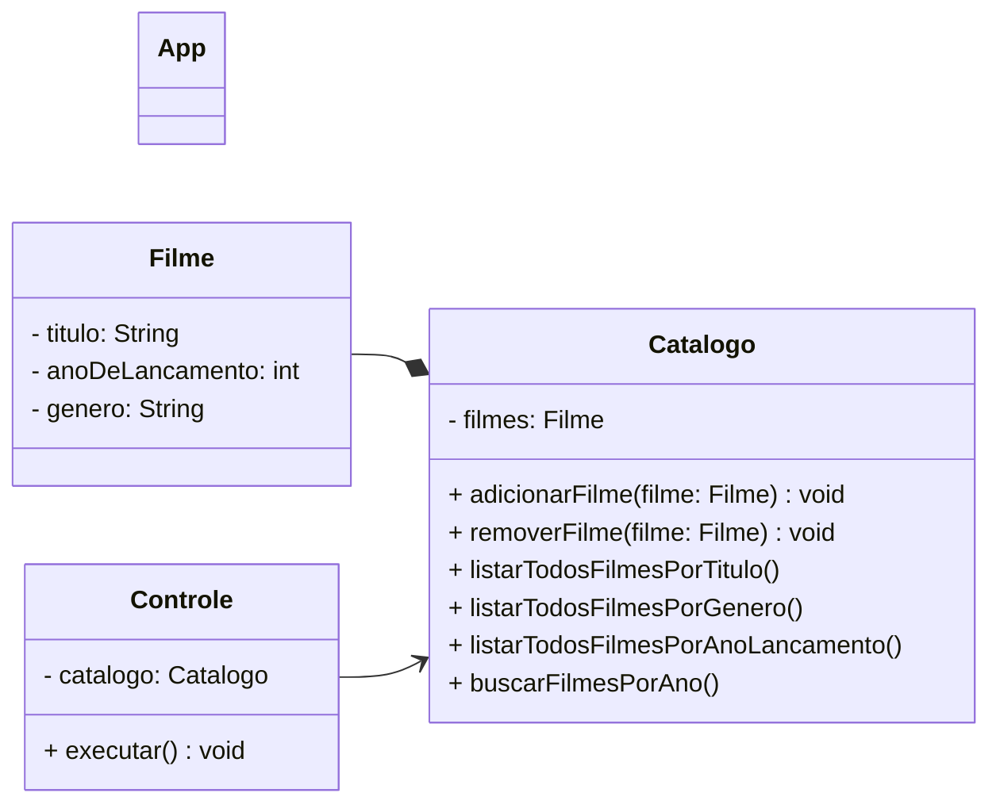

## Lista 3

### Pacote 1 - Diagrama

```mermaid

classDiagram
    
    direction LR
    
    class App {
        
    }
    
    class Controle {
        
        - catalogo: Catalogo
        
        + executar() void
        
    }
    
    class Catalogo {
        - filmes: Filme
        
        + adicionarFilme(filme: Filme) void
        + removerFilme(filme: Filme) void
        + listarTodosFilmesPorTitulo()
        + listarTodosFilmesPorGenero()
        + listarTodosFilmesPorAnoLancamento()
        + buscarFilmesPorAno()
        
    }
    
    class Filme {
        - titulo: String
        - anoDeLancamento: int
        - genero: String
    }
    
    Filme --* Catalogo
    Controle --> Catalogo


```